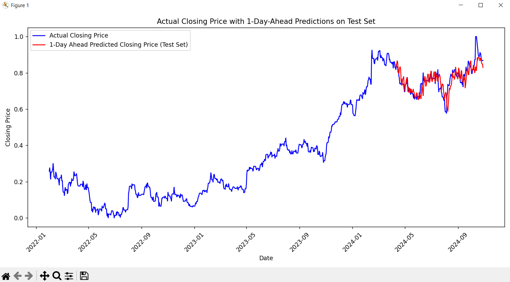
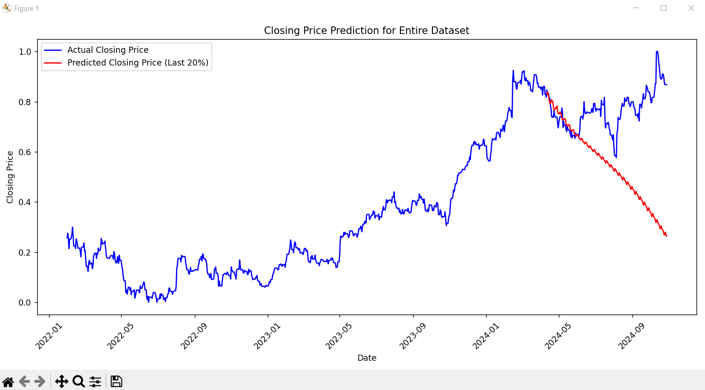

# Stock-Predictor  
**Stock Price Prediction Using an LSTM Neural Network**  

  

## Overview  
Stock-Predictor is a machine learning model that forecasts stock prices using **Long Short-Term Memory (LSTM) neural networks**. The model leverages historical stock data from **Yahoo Finance** (open, high, low, close, volume) and **Google Trends** search interest to make more informed predictions.  

## Features  
- Uses **Yahoo Finance** API to collect historical stock data.  
- Incorporates **Google Trends** data to capture market sentiment.  
- Implements an **LSTM neural network** to predict the next day's stock price using the past 30 days of data.  
- Supports **recursive predictions**, where the model iteratively predicts future stock prices by feeding its own outputs back into the input layer.  

## Predictions  

### **1-Day Prediction**  
  
This visualization shows the model’s **short-term accuracy** by predicting the next day's stock price based on the previous 30 days of data. The blue line represents actual prices, while the orange line represents predicted prices.  

### **Recursive Predictions**  
  
Here, the model **predicts multiple future days recursively** by feeding its own predictions back as inputs. While this method allows for extended forecasting, errors may compound over time.  

## Technologies Used  
- **Python** (Data Processing & Model Training)  
- **PyTorch** (LSTM Model Implementation)  
- **Pandas** (Data Manipulation)  
- **Scikit-learn** (Feature Scaling & Preprocessing)  
